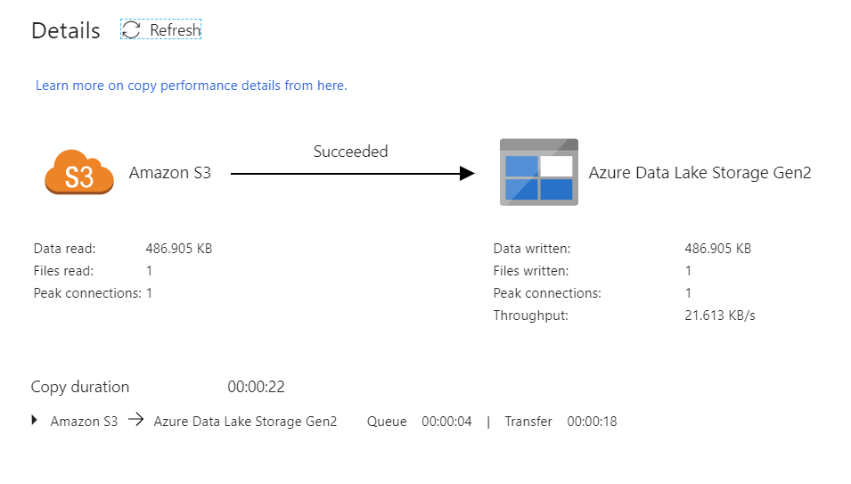
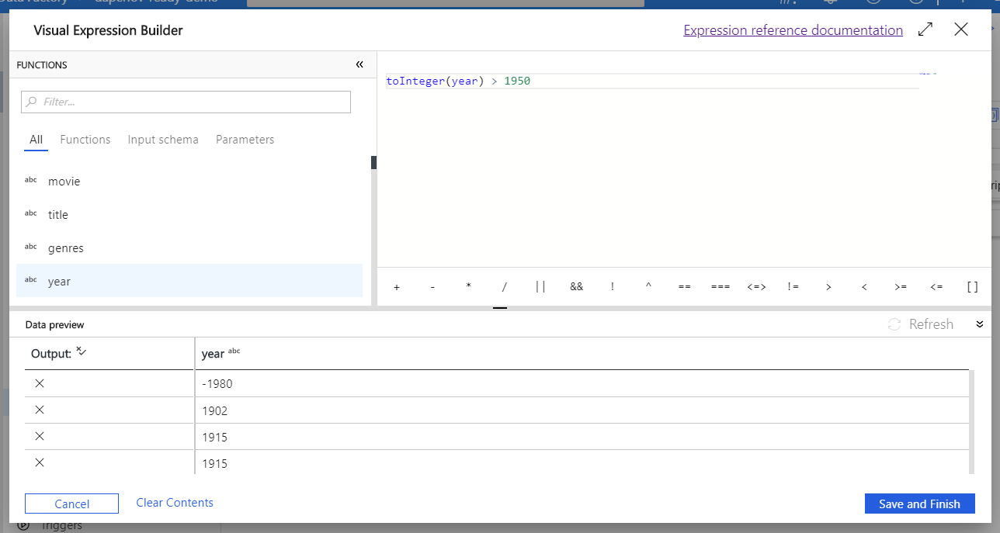
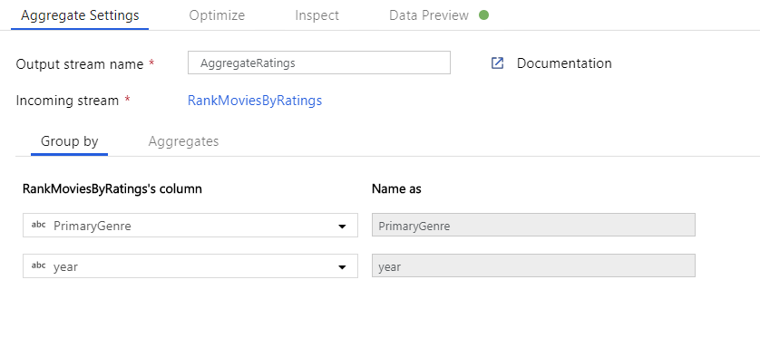
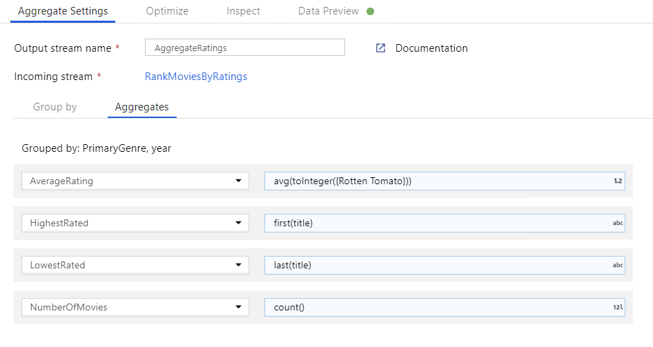
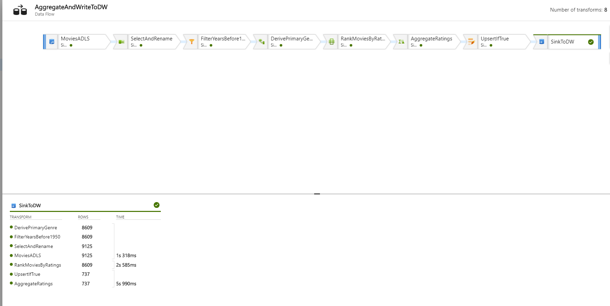

# Movies Analytics using Azure Data Factory

*If you're new to Azure Data Factory, see [Introduction to Azure Data Factory](https://docs.microsoft.com/en-us/azure/data-factory/introduction).*

In this Lab, you will utilize Azure Data Factory's visual authoring experience to create a pipeline that copies movie data stored in Amazon S3 to Azure Data Lake Storage Gen2 and then executes a Mapping Data Flow to transform and write the data to a SQL Data Warehouse.

## Prerequisites

* **Azure subscription**: If you don't have an Azure subscription, create a [free account](https://azure.microsoft.com/free/) before you begin.
* **Azure Data Lake Storage Gen2 storage account**: If you don't have an ADLS Gen2 storage account, see the instructions in [Create an ADLS Gen2 storage account](https://docs.microsoft.com/en-us/azure/storage/blobs/data-lake-storage-quickstart-create-account).
* **Azure SQL Data Warehouse** If you don't have an Azure SQL DW, see the instructions in [Create an SQL DW](https://docs.microsoft.com/en-us/azure/sql-data-warehouse/create-data-warehouse-portal)
* **Amazon S3 storage account** Used as our initial data source in our copy activity

## Setting up your environment

* **Create your data factory:** Use the [Azure Portal](https://portal.azure.com) to create your Data Factory. Detailed instructions can be found at [Create a Data Factory](https://docs.microsoft.com/en-us/azure/data-factory/quickstart-create-data-factory-portal)
  * Mapping Data Flow is not currently available in the following data factory regions: West Central US, Brazil South, Korea Central and France Central
* **Upload the [MoviesDB csv file](./moviesDB.csv) to S3 storage**
* **Create your linked services** You will need to create four linked services for this lab
  * [ADLS Gen2](https://docs.microsoft.com/en-us/azure/data-factory/connector-azure-data-lake-storage)
  * [Azure Blob Storage](https://docs.microsoft.com/en-us/azure/data-factory/connector-azure-blob-storage)
  * [Azure SQL DW](https://docs.microsoft.com/en-us/azure/data-factory/connector-azure-sql-data-warehouse)
  * [Amazon S3](https://docs.microsoft.com/en-us/azure/data-factory/connector-amazon-simple-storage-service)
  
## Copy Data From Amazon S3 to Azure Data Lake Storage Gen2
  
The first step in our pipeline is creating a Copy Activity that copies the moviesDB.csv file from S3 to ADLS Gen2 storage.

1. **Create the pipeline** Click on the + button in the Factory Resources pane and select Pipeline
2. **Add a copy activity** In the Activities pane, open the Move and Transform accordion and drag the Copy Data activity onto the pipeline canvas
3. **Create a new S3 dataset source**
    * In the Source tab, click + New
    * Select the Amazon S3 tile and click continue
    * Select the DelimitedText format tile and click continue
    * In Set Properties sidenav, select your S3 linked service. Point the file path to where you uploaded the moviesDB.csv file. Set First row as header to be true and Import schema from connection/store. Click Finish once completed.
4. **Create a new ADLS Gen2 dataset source**
    * In the Source tab, click + New
    * Select the Azure Data lake Storage Gen2 tile and click continue
    * Select the DelimitedText format tile and click continue
    * In Set Properties sidenav, select your S3 linked service. Point the folder where you want moviesDB.csv copied to. Set First row as header to be true. Import schema from sample file (use the moviesDB.csv file). Click finish once completed.

At this point, you have fully configured your copy activity. To test it out, click on the Debug button at the top of the pipeline canvas. This will start a pipeline debug run. To monitor the progress, click on the Output tab of the pipeline

To view a more detailed description of the activity output, click on the eyeglasses icon. This will open up the copy monitoring screen which provides useful metrics such as Data read/written, throughput and in-depth duration statistics.

To verify the copy worked as expected, open up your ADLS gen2 storage account and check to see your file was written as expected

## Transforming Data with Mapping Data Flow

Now that you have moved the data into ADLS, you are ready to build a Mapping Data Flow which will transform your data at scale via a spark cluster and then load it into a Data Warehouse. For more information on Mapping Data Flows, see the [Mapping Data Flow documentation](https://docs.microsoft.com/en-us/azure/data-factory/concepts-data-flow-overview).

1. **Turn on Data Flow Debug** Turn the Data Flow Debug slider on. Data Flow clusters take 5-7 minutes to warm up and users are recommended to turn on debug first if they plan to do Data Flow development. For more information, see [Debug Mode](https://docs.microsoft.com/en-us/azure/data-factory/concepts-data-flow-debug-mode)
2. **Add a Data Flow activity** In the Activities pane, open the Move and Transform accordion and drag the DAta Flow activity onto the pipeline canvas. In the sidenav that pops up, select Create new Data Flow and select Mapping Data Flow. Drag the green box from your Copy activity to the Data Flow Activity to create an on success condition.
3. **Add an ADLS source** Open the Data Flow canvas. Click on the Add Source button in the Data Flow canvas. In the source dataset dropdown, select your ADLS Gen2 dataset used in your Copy activity
    * If your dataset is pointing at a folder with other files, you may need to create another dataset or utilize parameterization to make sure only the moviesDB.csv file is read
    * Once your debug cluster is warmed up, you verify your data is loaded correctly via the Data Preview tab. Once you click the refresh button, Mapping Data Flow will show calculate a snapshot of what your data looks like when it is at each transformation.
4. **Add a Select transformation to rename and drop a column** You may have noticed that the Rotton Tomatoes column is misspelled. To correctly name it and drop the unused Rating column, you can add a [Select transformation](https://docs.microsoft.com/en-us/azure/data-factory/data-flow-select) by clicking on the + icon next to your ADLS source node. In the Name as field, change 'Rotton' to 'Rotten'. To drop the Rating column, hover over it and click on the trash can icon.

    

5. **Add a Filter Transformation to filter out unwanted years** Say you are only interested in movies made after 1950. You can add a [Filter transformation](https://docs.microsoft.com/en-us/azure/data-factory/data-flow-filter) to specify a filter condition. Click on the expression box to open up the [Expression builder](https://docs.microsoft.com/en-us/azure/data-factory/concepts-data-flow-expression-builder) and enter in your filter condition. Using the syntax of the [Mapping Data Flow expression language](https://docs.microsoft.com/en-us/azure/data-factory/data-flow-expression-functions), **toInteger(year) > 1950** will convert the string year value to an integer and filter rows if that value is above 1950.

    * You can use the expression builder's embedded Data preview pane to verify your condition is working properly

    

6. **Add a Derive Transformation to calculate primary genre** As you may have noticed, the genres column is a string delimited by a '|' character. If you only care about the first genre in each column, you can derive a new column via the [Derived Column](https://docs.microsoft.com/en-us/azure/data-factory/data-flow-derived-column) transformation. Similar to the filter transformation, the derived column uses the Mapping Data Flow expression builder to specify the values of the new column.

    

7. **Rank movies via a Window Transformation** Say you are interested in how a movie ranks within its year for its specific genre. You can use a [Window transformation](https://docs.microsoft.com/en-us/azure/data-factory/data-flow-window) to define window-based aggregations. To accomplish this, specify what you are windowing over, what you are sorting by, what the range is, and how to calculate your new window columns. In this example, we will window over PrimaryGenre and year with an unbounded range, sort by Rotten Tomato descending, a calculate a new column called RatingsRank which is equal to the rank each movie has within its specific genre-year.

    

    

    

    

8. **Aggregate ratings with an Aggregate Transformation** Now that you have gathered and derived all our required data, we can add an [Aggregate transformation](https://docs.microsoft.com/en-us/azure/data-factory/data-flow-aggregate) to calculate metrics based on a desired group. As you did in the window transformation, lets group movies by genre and year

    

    In the Aggregates tab, you can aggregations calculated over the specified group by columns. For every genre and year, lets get the average Rotten Tomatoes rating, the highest and lowest rated movie (utilizing our windowing function) and the number of movies that are in each group. Aggregation significantly reduces the amount of rows in your transformation stream and only propagates the group by and aggregate columns specify in the transformation.

    * To see how the aggregate transformation changes your data, use the Data Preview tab

    

9. **Specify Upsert condition via an Alter Row Transformation** If you are writing to a tabular sink, you can specify insert, delete, update and upsert policies on rows using the [Alter Row transformation](https://docs.microsoft.com/en-us/azure/data-factory/data-flow-alter-row). Since you are always inserting and updating, you can specify that all rows will always be upserted.

    

10. **Write to a SQL DW Sink** Now that you have finished all your transformation logic, you are ready to write to a Sink. Create a new SQL DW dataset via the + New button. Point the dataset at your SQL DW linked service and select Create new table. Since an upsert condition was specified, you need to go to the Settings tab and select Allow upsert based on key columns PrimaryGenre and year.

    

You have finished building your 8 transformation Mapping Data Flow. Its time to run the pipeline and see the results.

## Running the Pipeline

Go back to the pipeline canvas. Because you are writing to a SQL DW in your Data FLow, you must use a blob staging folder. In the Execute Data Flow activity's settings tab, open up the PolyBase accordion and select your Blob linked service and specify a staging folder path. Before you publish your pipeline, run another debug run to confirm its working as expected. Looking at the Output tab, you can monitor the status of both activities as they are running.

Once both activities succeeded, you can click on the eyeglasses icon next to the Data Flow activity to get a more in depth look at the Data Flow run.

Your Data Flow should have written 737 rows to your SQL DW. You can go into [SQL Server Management Studio](https://docs.microsoft.com/en-us/sql/ssms/download-sql-server-management-studio-ssms?view=sql-server-2017) to verify the pipeline worked correctly and see what got written.
